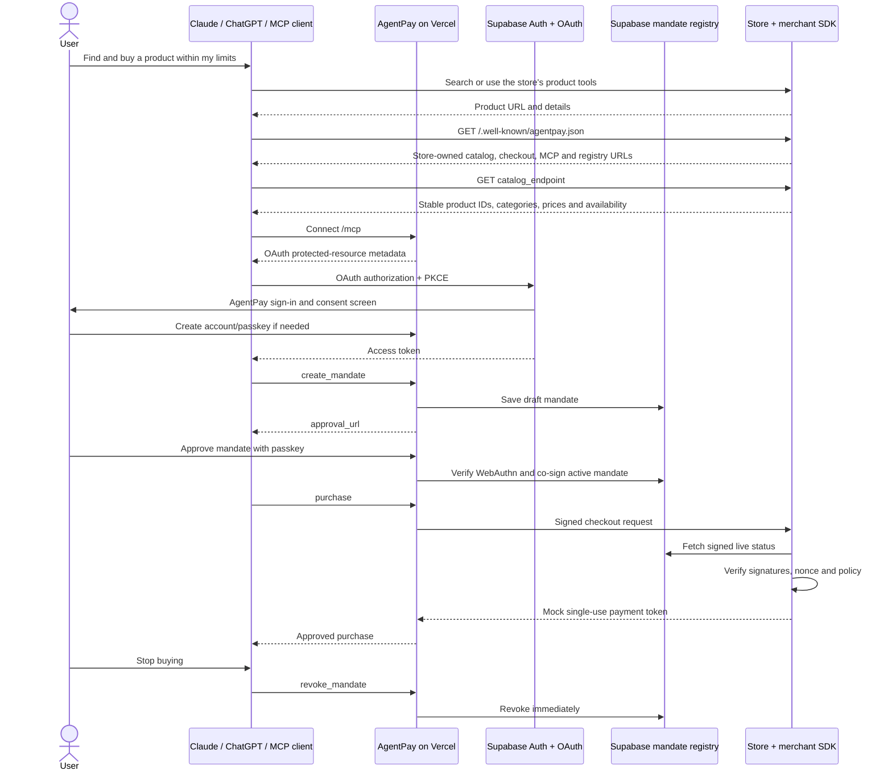

# AgentPay architecture

## Trust boundaries

- The agent proposes scope and purchase details but cannot approve its own authority.
- Supabase Auth owns user sessions and OAuth grants. AgentPay stores WebAuthn public credentials, never private passkey material.
- The registry signs canonical mandates and exposes only the exact signed records required for merchant verification.
- The store owns products, discovery and checkout. The SDK checks live revocation on every purchase.
- The merchant manifest is the machine contract. Agents copy product IDs from its live catalog endpoint rather than deriving them from display names, SKUs or URLs.
- The payment rail is the only mocked boundary. The mock token is issued only after the real authorization and enforcement path succeeds.
