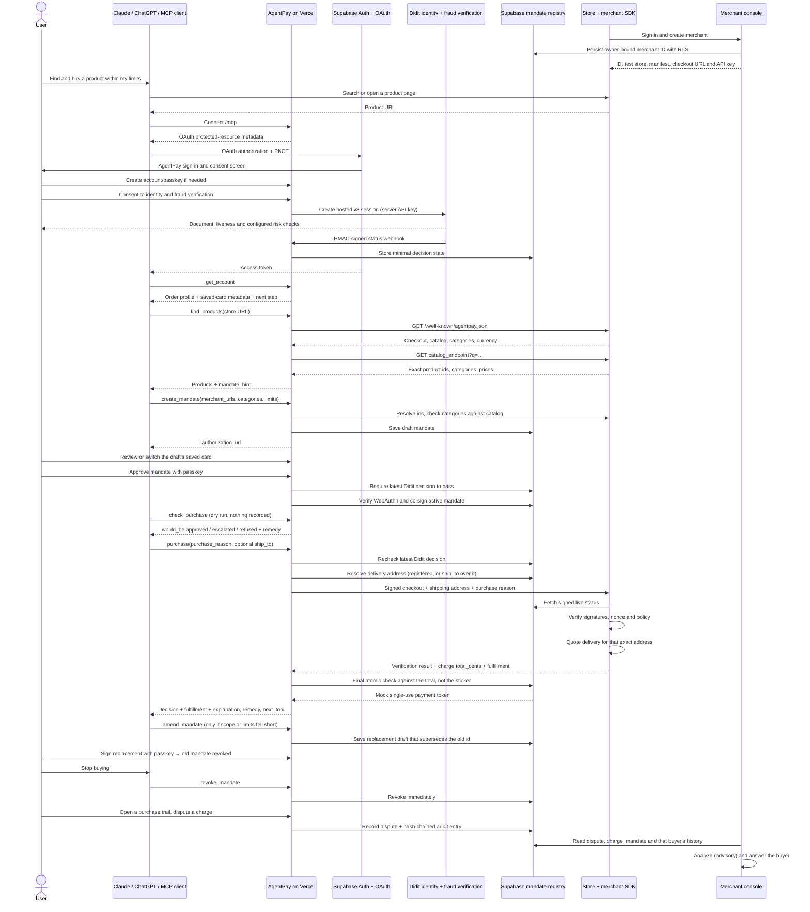

# AgentPay architecture

Checkout settlement and revocation use the same per-mandate transaction lock. A revocation that commits before the final check produces `MANDATE_REVOKED` and no token, including when the checkout began earlier.

## Trust boundaries

- The agent proposes scope and purchase details but cannot approve its own authority.
- Supabase Auth owns user sessions and OAuth grants. AgentPay stores WebAuthn public credentials, never private passkey material.
- Didit owns the hosted Free KYC capture. AgentPay sends the pinned public workflow ID and a stable opaque user ID, authenticates API calls server-side, validates webhook freshness and HMAC signatures, and persists only session, workflow, environment, decision, and entity-risk state. Full decisions, identity documents, images, and biometric data are not copied into AgentPay.
- A signed webhook is the normal decision path; the authenticated return route re-fetches the decision from Didit as a missed-webhook fallback. Both paths verify that the Didit session is bound to the same Supabase user and configured workflow.
- The MCP and demo checkout paths fail before contacting a merchant when verification is not current. A database trigger independently refuses every approved attempt, so a direct call cannot mint a mock payment token for an unverified, flagged, or blocked account; this also covers mandates that were active before the integration shipped.
- The database gate uses a one-way rollout latch that is enabled only after the deployed server successfully creates its first Didit session. Applying the migration before application deployment therefore leaves the current demo untouched, while a configured deployment cannot silently fall back to unchecked checkout.
- The registry signs canonical mandates and exposes only the exact signed records required for merchant verification.
- The store owns products, discovery, the catalog endpoint and checkout. AgentPay relays the store's catalog answer to the agent and never copies, indexes or ranks it. The SDK checks live revocation on every purchase.
- A dry run (`check_purchase`) uses the same policy engine as settlement but touches neither the merchant nor the attempt table, so exploring what a mandate allows costs nothing and leaves no trace of a purchase that never happened.
- A signed mandate is immutable. An amendment is a replacement draft; signing it is the same request that revokes the mandate it supersedes.
- The merchant console owns onboarding, not purchase authority. Supabase RLS binds each merchant, catalog, API-key hash and merchant-side attempt view to its developer owner. Hosted test stores are immediately usable but never publicly listed.
- Developer SQL privileges cannot write `agent_ready` or verification columns. Live verification is fetched server-side with SSRF protections, then a narrowly scoped owner-bound function requires AgentPay's server-only proof before recording the result; changing a live store URL automatically clears verification and public listing.
- The payment rail is the only mocked boundary. The mock token is issued only after the real authorization and enforcement path succeeds and is bound to the card ID inside the signed mandate.
- Product prices, signed mandate limits, recorded attempts and mock-token allowances are USD integer cents. No component performs foreign-exchange conversion; a currency mismatch is refused before payment.
- Compliance and delivery fields are user-owned RLS data. They are available only through the authenticated account/MCP connection and never enter public registry projections or payment tokens.
- The delivery address is AgentPay's to hold, not the agent's to collect. An order ships to the registered address unless the user names a one-off `ship_to`, which applies to that order only and is never written back to the account. An agent that had to ask for an address would be asking whoever is talking to it.
- Delivery is priced by the store, before the policy runs, for the exact address on the request. The mandate is evaluated against `charge.total_cents` — product plus delivery — so a per-purchase limit covers what is actually charged and an approval hash is bound to that same total. A store that does not serve the address refuses with `SHIPPING_ADDRESS_UNSUPPORTED` before a mandate use is spent.
- Every attempt states why it was made. `purchase_reason` is required by the settlement function itself, not only by the tool schema, so no path — including the console trial — can record a charge with no stated motivation. It is inside the hash-chained audit payload rather than beside it.
- Disputes are the one corrective control. Writes go through `SECURITY DEFINER` functions rather than RLS policies, so a buyer cannot mark their own case refunded and a merchant cannot withdraw one on the buyer's behalf; a partial unique index allows one open case per charge. Both sides read the same rows and the same timeline.
- The merchant sees the buyer as `sha256(user_id + "|" + merchant_id)` — stable within one merchant, unlinkable across merchants, and never the account id. It is enough to recognise a repeat customer and not enough to identify a person.
- Dispute analysis is advisory and structurally cannot decide. It writes only to `analysis`; `status` is set by a person through a different function. With no `ANTHROPIC_API_KEY`, or when the API call fails, a deterministic reading runs instead and labels itself in `engine`, so the console never silently loses the feature mid-demo.
