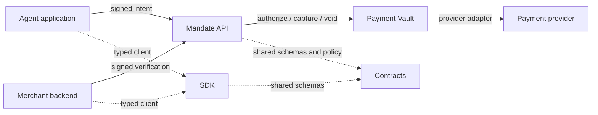

# Architecture

## Boundaries

- The SDK contains transport and proof-signing helpers. It does not hold user payment data or service credentials.
- The Mandate API owns authorization policy and capability lifecycle. Runtime composition must inject durable persistence, authentication, registries, taxonomy, and keys.
- The Payment Vault owns payment-method and provider-token boundaries. Merchant and agent callers never receive provider credentials or raw payment data.
- Contracts are shared wire schemas. Domain code contains deterministic, side-effect-free rules.
- In-memory stores and deterministic payment behavior exist only to test these boundaries.

## Integration path

1. Implement durable adapters for the interfaces exposed by both backend apps.
2. Connect a real payment provider behind the vault's payment-router interface.
3. Compose and deploy each Hono app as an independently authenticated service.
4. Use `@agentic-mandates/sdk` from agent and merchant backends.
5. Run the attack-suite scenarios against the composed system before exposing settlement.
