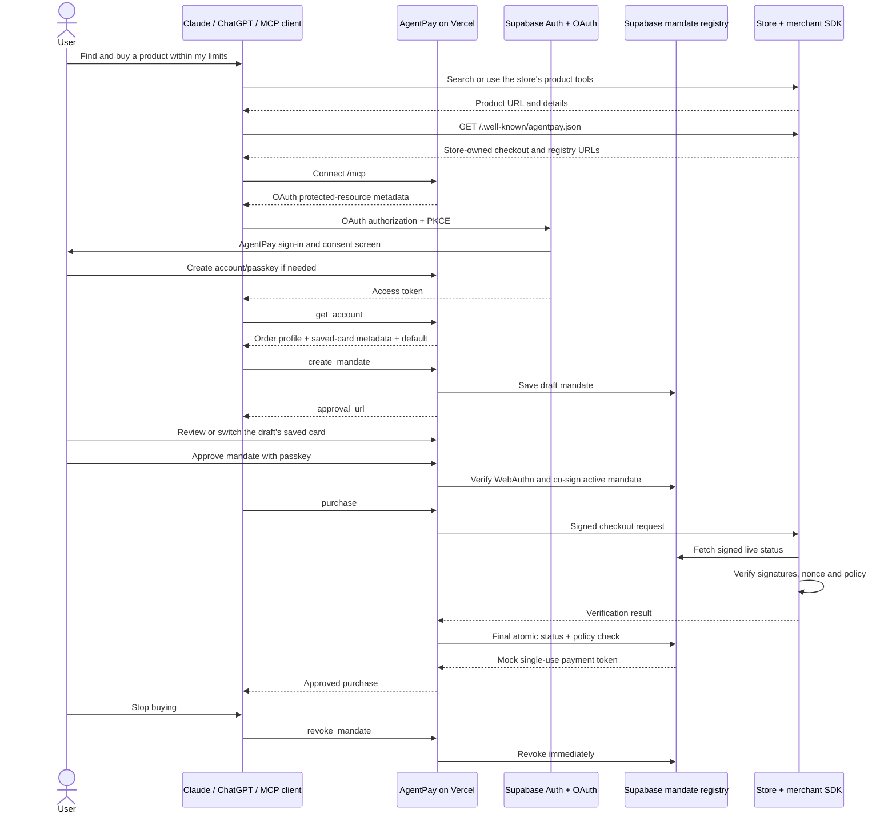

# AgentPay architecture

Checkout settlement and revocation use the same per-mandate transaction lock. A revocation that commits before the final check produces `MANDATE_REVOKED` and no token, including when the checkout began earlier.

## Trust boundaries

- The agent proposes scope and purchase details but cannot approve its own authority.
- Supabase Auth owns user sessions and OAuth grants. AgentPay stores WebAuthn public credentials, never private passkey material.
- The registry signs canonical mandates and exposes only the exact signed records required for merchant verification.
- The store owns products, discovery and checkout. The SDK checks live revocation on every purchase.
- The payment rail is the only mocked boundary. The mock token is issued only after the real authorization and enforcement path succeeds and is bound to the card ID inside the signed mandate.
- Compliance and delivery fields are user-owned RLS data. They are available only through the authenticated account/MCP connection and never enter public registry projections or payment tokens.

## Audit integrity

Every mandate, approval, vault and checkout decision appends an account-owned audit event inside Supabase. Appends take a per-user transaction lock, so concurrent actions agree on one previous hash and cannot fork the chain.

Audit chain version 2 stores the exact UTF-8 JSON text used as the digest material. The event hash is `SHA-256(previous_hash || hash_material)`. The browser does two checks: it parses `hash_material` and compares it with the visible timestamp, actor, action, entity and payload, then recomputes the link hash. Keeping the exact material avoids relying on PostgreSQL and JavaScript to serialize the same object identically while still detecting changes to either the event or the chain.

The migration to version 2 preserves event content, order and timestamps while rebuilding the derived hashes once. New events are appended only through `append_agentpay_audit`; authenticated users have no update or delete grant on the audit table. Like any local hash chain, this detects mutation relative to the downloaded or previously observed head; an external timestamp or transparency service would be required to prove that a privileged database operator did not replace the entire chain.
