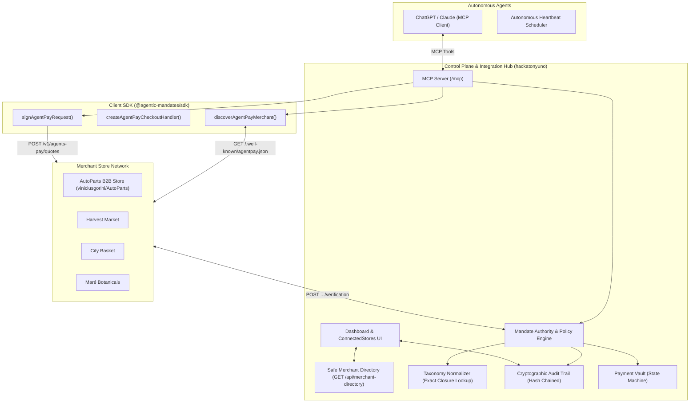

# Control Plane Integration Plan: AgentPay Hub, SDK & Store Network

## Executive Summary

This document specifies the integration architecture and operational responsibilities of the **Control Plane & Integration Hub** (`pedroschott/hackatonyuno`). The Control Plane serves as the central authority coordinating:
1. **The Store Network**: AutoParts B2B (`viniciusgorini/AutoParts`), Harvest Market, City Basket, and Maré Botanicals.
2. **The Client SDK**: `@agentic-mandates/sdk`.
3. **Autonomous Procurement Agents**: ChatGPT / Claude connected via MCP Server (`/mcp`).
4. **Human-in-the-Loop Governance**: CFO / Fleet Manager Dashboard, Passkey Approval Ceremonies, and Cryptographic Audit Trails.



---

## 1. Core Integration Scope & Deliverables

### Item 1: Connected Stores UI Component on Dashboard
- **Component**: `components/dashboard/ConnectedStores.tsx`
- **Location**: Mounted prominently on `app/(agentpay)/dashboard/page.tsx`.
- **Functionality**:
  - Live store cards for **AutoParts**, **Harvest Market**, **City Basket**, and **Maré Botanicals**.
  - Dynamic mandate compatibility calculation based on active mandate:
    - `In scope` (Green badge) — Mandate explicitly authorizes this merchant and canonical category.
    - `Approval required` (Amber badge) — Partially covered or requires passkey escalation.
    - `Outside scope` (Neutral badge) — Not permitted under the current active mandate.
  - Direct links to **Storefront** (`/store` or merchant URL) and **Discovery JSON** (`/.well-known/agentpay.json`).

### Item 2: Secure Merchant Directory API
- **Endpoint**: `GET /api/merchant-directory`
- **Guarantees**:
  - Authenticated endpoint serving as the single source of truth for the Dashboard, Contract Creation Builder, and Mobile views.
  - Returns safe display metadata (`id`, `name`, `slug`, `vertical`, `currency`, `storefront_url`, `discovery_url`, `supported_canonical_categories`).
  - **Zero Security Leakage**: Completely strips private JWKs, trust tier ratings, and vault credentials.
  - Eliminates hardcoded `seedMerchants` dependencies from client UI components.

### Item 3: Initial Taxonomy Normalization (Exact Lookup)
- **Database Architecture**: `agentpay_private.taxonomy_category_closure` and `agentpay_private.merchant_taxonomy_mappings`.
- **Deterministic Resolution**:
  - AutoParts local `'tires'` $\rightarrow$ Canonical `automotive.tires` (Depth 0)
  - Harvest Market local `'pantry.rice-and-grains'` $\rightarrow$ Canonical `food.grains.rice` (Depth 1)
  - City Basket local `'grocery/dry-goods/rice'` $\rightarrow$ Canonical `food.grains.rice` (Depth 1)
  - Maré Botanicals local `'skincare.face'` $\rightarrow$ Canonical `beauty.skincare` (Depth 0)
- **Explicit Failure for Unmapped Categories**: Local categories marked as retired or unmapped (e.g. `stored-value.store-credit`, `vouchers.gift`) fail immediately with `UNMAPPED_CATEGORY`.
- **Strict Invariant**: No probabilistic filters (Bloom filters) in the authorization path — deterministic exact lookup only.

### Item 4: Shared 1-Page Merchant Integration Contract
- **Document**: `docs/merchant-integration-contract.md`
- **Purpose**: A concise, immutable integration contract for the team:
  - **SDK Engineer**: Implements client-side discovery and request signing helpers.
  - **Store Engineer**: Implements store-side quote calculation, JWS signing, and verification claims.
  - **Control Plane**: Enforces policy, normalizes taxonomy, mints payment tokens, and records audit logs.

### Item 5: Autonomous B2B Tools for ChatGPT / Claude via MCP
- **MCP Server Route**: `app/mcp/route.ts` & `lib/mcp/agentpay-tools.ts`
- **Tools**:
  1. `get_account`: Retrieves saved cards, active mandates, and pending passkey approvals.
  2. `get_payment_setup_link`: Returns a short-lived link for adding payment methods without exposing card numbers to chat.
  3. `create_mandate`: Drafts an Intent Mandate with specific budget, category, and expiry constraints.
  4. `search_store_catalog`: Searches parts, prices, and stock at AutoParts or other merchants.
  5. `request_store_quote`: Requests an immutable signed quote with batch quantities and fleet metadata (`vehicle_plate: "FLT-8092"`, `purchase_order: "PO-2026-089"`).
  6. `execute_mandate_purchase`: Submits the signed quote to AgentPay, checks policy limits, mints single-use tokens, and confirms order placement.
  7. `revoke_mandate`: Instantly revokes autonomous purchasing authority.

---

## 2. End-to-End Golden Path & Acceptance Criteria

```
[1. Dashboard UI]
Connected Stores appear on Dashboard with live status and compatibility badges
      ↓
[2. Mandate Creation]
CFO creates Intent Mandate for canonical category (e.g. automotive.tires, $2,000 limit)
      ↓
[3. Autonomous Agent]
ChatGPT / Fleet Procurement Agent receives command:
"Order 4 standard tires for Fleet Van #12 at AutoParts"
      ↓
[4. Store Discovery & Quote]
Agent discovers AutoParts via /.well-known/agentpay.json and requests signed quote ($1,548)
      ↓
[5. Control Plane Evaluation]
Quote returns local category 'tires' → Normalizer resolves 'automotive.tires'
Policy checks: $1,548 <= $2,000 budget & within validity window → APPROVED
      ↓
[6. Vault Settlement]
Payment Vault mints single-use payment token locked to AutoParts and $1,548
      ↓
[7. Order Confirmation & Audit]
AutoParts verifies token, logs Invoice # INV-2026-089
Audit trail records tamper-evident, hash-chained log on the Dashboard
```

---

## 3. Team Responsibilities & Boundaries

| Responsibility | Owner | Repository |
| :--- | :--- | :--- |
| **Control Plane & Mandate Authority** | You (Lead Integration) | `pedroschott/hackatonyuno` |
| **Payment Vault & State Machine** | You (Lead Integration) | `pedroschott/hackatonyuno` |
| **MCP Server & GPT Agent Tools** | You (Lead Integration) | `pedroschott/hackatonyuno` |
| **Client SDK (`@agentic-mandates/sdk`)** | SDK Contributor | `packages/sdk` / workspace |
| **Standalone B2B AutoParts Store** | Store Contributor | `viniciusgorini/AutoParts` |

---

## 4. Next Implementation Steps

1. **Step 1**: Commit this plan to `docs/control-plane-integration-plan.md` on branch `feat/control-plane-integration-and-contract`.
2. **Step 2**: Create `docs/merchant-integration-contract.md` (the 1-page integration contract for teammates).
3. **Step 3**: Expand `lib/mcp/agentpay-tools.ts` with B2B catalog search and quote generation tools.
4. **Step 4**: Create `docs/gpt-b2b-procurement-guide.md` with system prompt and rehearsal runbooks.
5. **Step 5**: Run full workspace test validation (`npm run check`) and open pull request.
